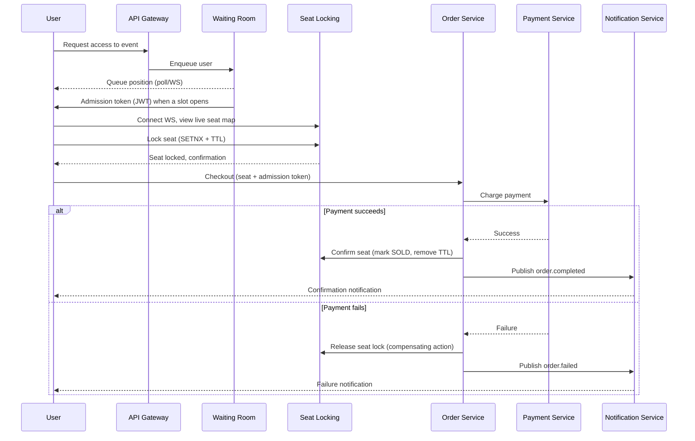

# Gatekeeper — Architecture

## Overview

Gatekeeper is not a ticket-selling website — it's the traffic-control infrastructure that sits in front of one. When thousands of users hit an on-sale event at the same moment, most ticketing systems either fall over or oversell the same seat to multiple buyers. Gatekeeper solves both problems with two core mechanisms:

1. A **virtual waiting room** that throttles how many users are allowed into the checkout flow at once.
2. A **distributed seat-locking layer** that guarantees no two users can ever hold the same seat, even under massive concurrent load.

Concert ticketing is used as the demo domain, but the underlying services are domain-agnostic — the same infrastructure works for course registration, flight seat selection, or any limited-inventory drop.

## Services

### 1. API Gateway
- Single entry point for all client traffic.
- Routes requests to the correct downstream service.
- Applies per-IP / per-user rate limiting (Redis-backed token bucket) to absorb raw traffic spikes before they ever reach the waiting room.

### 2. Waiting Room Service
- Maintains a virtual queue per event using a Redis sorted set (score = arrival timestamp).
- A background admitter loop admits N users every T seconds into the "checkout zone."
- Issues short-lived signed JWT admission tokens — only holders of a valid token can reach Seat Locking or Order.
- Exposes a polling / WebSocket endpoint so clients can watch their live queue position.

### 3. Seat Locking Service
- Holds the authoritative, real-time seat map for each event in Redis.
- Seat selection uses `SETNX seat:{eventId}:{seatId}` with a TTL (`LOCK_TTL_MINUTES`, default 2 minutes) — this is the core concurrency guarantee: only one request can ever win the lock.
- Broadcasts seat state changes (`locked` / `released` / `sold`) to all connected clients over WebSocket via Redis Pub/Sub, so every browser sees the live seat map update instantly.
- Locks expire automatically if checkout isn't completed in time, releasing the seat back to the pool.
- `lock` is reachable by any admitted client (that's the point) — but each service is deployed with its own public URL, so this service verifies the admission JWT itself rather than trusting that every request arrived through the Gateway. `release` and `confirm` are server-to-server only — they require the shared `INTERNAL_SECRET` header — because they're meant to be called by the Order Service alone; without that check, any client could confirm a seat SOLD directly, skipping payment entirely.

### 4. Order Service (Saga Orchestrator)
- Owns the purchase saga: reserve → charge → confirm, with compensating actions on failure.
- Orchestrates calls to Payment and Seat Locking; if payment fails, it triggers the compensating action (release the seat lock) instead of leaving it stuck.
- Publishes domain events (`order.completed`, `order.failed`) to the message broker.
- The only service that holds `INTERNAL_SECRET` as a caller — it's the sole trusted client of Seat Locking's release/confirm and Payment's charge/refund.

### 5. Payment Service
- Simulates an external payment gateway (mock charge/refund endpoints).
- Idempotent by design — the same order ID can never be charged twice, even under retry.
- `charge` and `refund` require the shared `INTERNAL_SECRET` header, same reasoning as Seat Locking's release/confirm: only the Order Service should ever be able to move money.

### 6. Notification Service
- Subscribes to order events and sends confirmation/failure messages (mocked as logs or an email stub).
- Fully decoupled — can be scaled or replaced without touching the purchase flow.

## Purchase Flow (Sequence)

## Why This Design Is Interesting (interview talking points)

- Demonstrates the exact failure mode that took down Ticketmaster's 2022 Taylor Swift on-sale (uncontrolled concurrent demand) — and how a waiting room + distributed lock actually prevents it.
- Saga pattern with compensating transactions instead of a two-phase commit across services.
- Idempotency enforced at the payment boundary.
- Real-time fan-out via Redis Pub/Sub + WebSocket instead of client-side polling.
- Each service owns its own data store — failures are isolated instead of cascading through a single shared database.
- The waiting room is actually enforced, not decorative: both the API Gateway and Seat Locking itself verify the admission JWT's signature, expiry, and that it was issued for the exact event/user in the request, before letting a lock request through. Checking it twice matters because each service has its own public URL on Render — if only the Gateway checked, skipping the queue would be as easy as calling Seat Locking's URL directly instead.
- Server-to-server endpoints are actually restricted, not just documented as such: Seat Locking's `release`/`confirm` and Payment's `charge`/`refund` are meant to be called by the Order Service alone, and each one rejects any request that doesn't carry the shared `INTERNAL_SECRET`. Without that check, the gateway's own `/seats/` passthrough would let any client confirm a seat SOLD directly — skipping payment altogether.

## Tech Stack

- **Language:** Go
- **HTTP:** Gin
- **WebSocket:** gorilla/websocket
- **Cache / Locks / Queue:** Redis
- **Message broker:** RabbitMQ (event bus between services)
- **Database:** PostgreSQL, one database per service
- **Auth:** JWT (admission tokens + user auth)
- **Containerization:** Docker Compose

## Suggested Build Order

1. **Seat Locking Service** — the core concurrency guarantee, and the most interesting problem in the project. Start here.
2. **Waiting Room Service** — queue + admission tokens.
3. **Order Service** — saga orchestration.
4. **Payment Service** — mock, idempotent.
5. **Notification Service** — event consumer.
6. **API Gateway** — tie everything together, add rate limiting last.

Building in this order means the hardest and most portfolio-relevant problem (correct locking under concurrency) gets solved first, before wiring the rest of the system around it.
