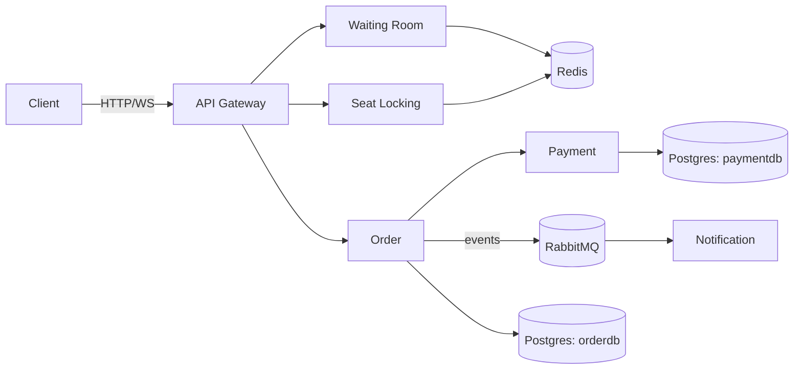

# Gatekeeper

[](https://github.com/EkimBolat/gatekeeper/actions/workflows/ci.yml)
[](https://go.dev)
[](./LICENSE)

Traffic-control infrastructure for high-demand on-sales — the piece that sits in front of a ticket-selling site, not the site itself. When thousands of people try to buy the same limited inventory at once, nothing should ever sell twice. Inspired by Ticketmaster's 2022 Taylor Swift on-sale crash. Concert ticketing is the demo domain; the services underneath are domain-agnostic.

**[Try the live demo](https://ekimbolat.github.io/gatekeeper/demo/seat-map.html)** — join a queue, get admitted, pick a seat, check out, against 5 real services on Render. (First request may take ~50s — free instances sleep when idle.)


## Highlights

- **Concurrency-safe locking** — Redis `SETNX` + TTL; exactly one winner per seat, proven both locally (50 concurrent goroutines) and against the live deployment (100 real HTTP clients, one winner, zero errors — see [Testing](#testing)).
- **Purchase saga** — charge, confirm the seat, and roll back cleanly if any step fails.
- **Enforced waiting room** — admission tokens are verified independently by both the gateway and Seat Locking, so the queue can't be skipped by calling a service directly.
- **Internal-only endpoints** — seat confirm/release and payment charge/refund require a shared secret only the Order Service holds.
- **Live seat map** over WebSocket, a **multi-event catalog**, and **deployed for real** on Render — not just `docker-compose up` on a laptop.

## Architecture

Six small services, each owning its own piece. Full request flow and design rationale in [ARCHITECTURE.md](./ARCHITECTURE.md).

| Service | Responsibility |
|---|---|
| **api-gateway** | Routes requests, rate-limits by IP, enforces admission tokens |
| **waiting-room** | Virtual queue, admits in batches, issues admission tokens |
| **seat-locking** | Redis-backed seat lock, live status over WebSocket |
| **order** | Purchase saga: charge → confirm → compensate on failure |
| **payment** | Mock processor, idempotent per order |
| **notification** | Consumes order events off RabbitMQ |



## Tech stack

Go · Redis · RabbitMQ · PostgreSQL · WebSocket · Docker Compose

## Getting started

```bash
git clone https://github.com/EkimBolat/gatekeeper.git
cd gatekeeper
docker-compose up --build
```

Each service exposes `/health` on its own port (api-gateway `8080`, waiting-room `8081`, seat-locking `8082`, order `8083`, payment `8084`, notification `8085`; RabbitMQ UI on `15672`, guest/guest).

`demo/seat-map.html` is a single dependency-free HTML file. It points at the hosted Render backend by default — to run it against your local stack instead, change `GATEWAY_URL` at the top of the `<script>` to `http://localhost:8080`.

Open it in two tabs with different user IDs and race for the same seat to watch the lock resolve live. Checkout has a checkbox to simulate a declined card, and the confirmation screen has a "Full reset" button to clear an event's locks/sales.

## Testing

```bash
cd services/seat-locking && go test -tags=integration ./... -v
cd services/order && go test -tags=integration ./... -v
```

`TestLockSeat_ConcurrentCallers_OnlyOneWins` is the core guarantee: 50 concurrent goroutines race one seat, exactly one wins. `scripts/loadtest` proves the same thing over real HTTP against the live deployment — 100 concurrent clients, 1 winner, 0 errors; see that directory for usage. CI runs `go test ./...` for every service on each push.

## Status

Core system complete — all 6 services work end to end, including the full purchase saga with compensating actions on failure. Concurrency, saga, and auth behavior are covered by unit tests, integration tests, and the live load test above.

## License

MIT — see [LICENSE](./LICENSE).
