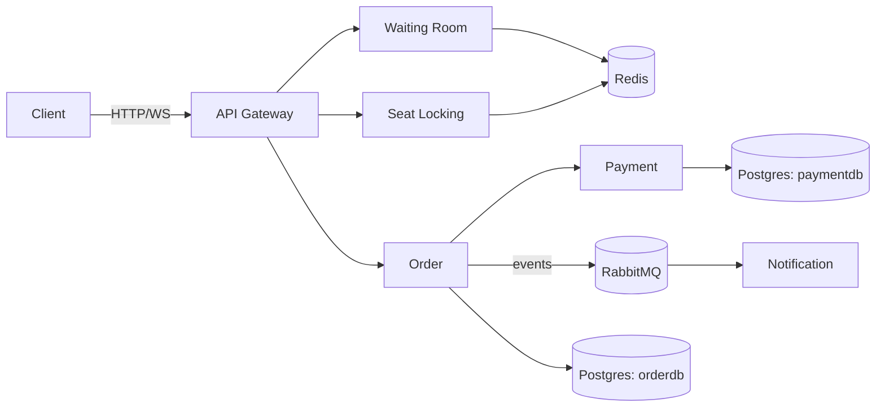

# Gatekeeper

[](https://github.com/EkimBolat/gatekeeper/actions/workflows/ci.yml)
[](https://go.dev)
[](./LICENSE)

A backend-focused learning project: the traffic-control infrastructure that sits in front of a ticket-selling website, not the website itself. When thousands of people try to buy the same limited inventory at once, how do you make sure nothing ever gets sold twice? Inspired by Ticketmaster's 2022 Taylor Swift on-sale, which crashed for exactly that reason. Concert ticketing is the demo domain, but the services underneath are domain-agnostic — the same waiting-room + seat-lock design works for course registration, flight seat selection, or any limited-inventory drop.

**[Try the live demo](https://ekimbolat.github.io/gatekeeper/demo/seat-map.html)** — pick an event from the catalog, join its queue, get admitted, pick a seat, check out. All 5 backend services running for real, hosted free on Render. (First request may take ~50s: free instances spin down when idle.)


## Highlights

- **Concurrency-safe seat locking** — Redis `SETNX` + TTL guarantees exactly one winner when multiple requests race for the same seat, proven with a test that fires 50 concurrent goroutines at it.
- **Purchase saga** — the order flow charges payment, confirms the seat, and rolls back (releases the seat, no charge) if any step fails, instead of leaving things in a half-done state.
- **Virtual waiting room** — a queue that admits users in small batches and issues a signed token; both the gateway and Seat Locking itself reject any lock request that doesn't carry a valid one, so skipping the line isn't possible even by calling a service's URL directly.
- **Locked-down internal APIs** — confirming a seat as sold and charging/refunding a payment are only ever meant to happen server-to-server, as steps in the saga. Those endpoints require a shared secret that only the Order Service holds, so they can't be called directly to bypass payment.
- **Live seat map** — seat status streams to every connected client over WebSocket as it changes.
- **Multi-event catalog** — the demo lists several concerts and movies to choose from; `eventId` is just an arbitrary string as far as the backend is concerned, so every listed event gets its own fully independent queue, seat map, and locks for free.
- **Deployed for real** — not just `docker-compose up` on a laptop; all services run live on Render with a public demo.

## Architecture

The project is made of 6 small services, each responsible for its own piece:

| Service | Responsibility |
|---|---|
| **api-gateway** | Routes requests to the right service, rate-limits by IP, enforces that locking a seat or placing an order requires a valid admission token |
| **waiting-room** | Puts users in a virtual queue under load, admits a few at a time, issues the admission token |
| **seat-locking** | Seat selection/locking — the most critical part of the project — backed by Redis, with live status pushed over WebSocket |
| **order** | Owns the purchase saga: charge payment, confirm the seat, compensate on failure |
| **payment** | Mock payment processor (no real money), idempotent per order |
| **notification** | Consumes order-completed events off RabbitMQ and logs a mock notification |

See [ARCHITECTURE.md](./ARCHITECTURE.md) for the full request flow and design rationale.



## Tech stack

Go · Redis · RabbitMQ · PostgreSQL · WebSocket · Docker Compose

## Getting started

```bash
git clone https://github.com/EkimBolat/gatekeeper.git
cd gatekeeper
docker-compose up --build
```

Once running, each service exposes a `/health` endpoint:

| Service | Port |
|---|---|
| api-gateway | 8080 |
| waiting-room | 8081 |
| seat-locking | 8082 |
| order | 8083 |
| payment | 8084 |
| notification | 8085 |
| RabbitMQ management UI | 15672 (guest/guest) |

`demo/seat-map.html` is a single, dependency-free HTML file — no build step, no framework. It points at the hosted Render backend by default; to run it fully locally instead, change `GATEWAY_URL` at the top of the `<script>` to `http://localhost:8080` and run `api-gateway`, `waiting-room`, `seat-locking`, `order`, and `payment` on your machine.

Open the demo in two tabs with different user IDs, pick the *same* event in both, and race for the same seat to watch the lock guarantee resolve live. There's also a checkbox on checkout to simulate a declined card, so you can watch the saga release the seat back to the pool, and a "Full reset" button on the confirmation screen that clears every lock/sale for the currently selected event if testing has left things in an awkward state.

## Testing

CI runs `go test ./...` for every service on each push. `seat-locking` and `order` additionally have integration tests behind a build tag, since those need a real Redis / Postgres to run against:

```bash
cd services/seat-locking
go test -tags=integration ./... -v

cd services/order
go test -tags=integration ./... -v
```

The one worth reading is `TestLockSeat_ConcurrentCallers_OnlyOneWins` in `services/seat-locking/lock_test.go` — it fires 50 concurrent goroutines at the same seat and asserts exactly one of them wins the lock. That's the core guarantee of the whole project, proven with a test instead of just a claim.

## Status

The core system is done — all 6 services work end to end, including the full purchase saga with compensating actions on failure.

- [x] seat-locking — locking with Redis `SETNX` + TTL, live seat status over WebSocket, ownership-checked confirm/release, verifies the admission token itself instead of trusting the gateway alone
- [x] waiting-room — queueing system, admission tokens
- [x] order — saga flow (charge → confirm seat, release/refund on failure)
- [x] payment — fake payment service, idempotent by orderId
- [x] notification — consumes order events from RabbitMQ, logs mock notifications
- [x] api-gateway — reverse proxy to all services, per-IP rate limiting, admission-token enforcement
- [x] internal-only endpoints — seat confirm/release and payment charge/refund require a shared secret, so they can't be called directly by a client
- [x] tests — concurrency test on the seat lock, saga tests on the order flow, auth tests on the internal-only and admission-gated endpoints
- [x] CI (GitHub Actions): builds and tests all 6 services, plus integration tests for seat-locking/order, on every push

## License

MIT — see [LICENSE](./LICENSE).
